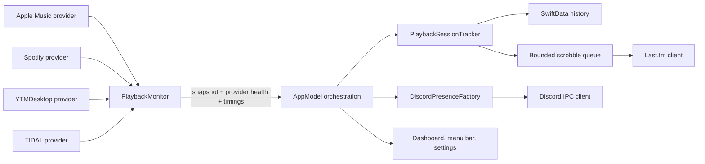

# PresenceFM Architecture

PresenceFM is a local-first macOS menu-bar app. External publishing is optional; listening history, diagnostics, preferences, and the retry queue remain on the Mac.

## Boundaries

- `PlaybackMonitor` owns provider polling, deterministic source selection, provider health, and performance signposts.
- `PlaybackSessionTracker` converts playback snapshots into sessions and eligibility transitions without network or UI dependencies.
- `DiscordPresenceFactory` turns a session, snapshot, and preferences into a deterministic Discord presence value. The IPC client only validates, bounds, and transports that value.
- `ScrobbleQueue` owns bounded admission, deduplication, retries, and permanent failure behavior.
- `PersistenceStore` owns SwiftData access, retention, health history, and migration entry points.
- `AppModel` remains the main-actor lifecycle coordinator. New formatting and transport rules should live in the relevant boundary instead of growing the coordinator.

## Privacy and failure flow

Private Mode and Demo Mode prevent Discord and Last.fm publishing before payload construction or queue admission. Provider failures are reported independently so one unavailable player does not mask playback from another. Persistence failures fall back to an in-memory session without overwriting the original store.

## Performance verification

Provider calls are skipped once a higher-priority active source is selected, YouTube Music has its own slower request interval, and every poll emits an Instruments signpost. See [PERFORMANCE.md](PERFORMANCE.md) for budgets and the soak-test record.
